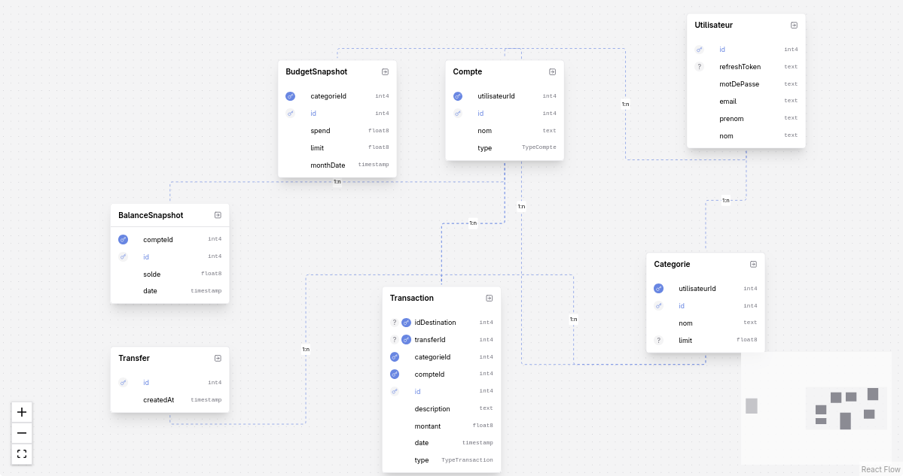

<div align="center">
  <h1>💰 Dirhamy</h1>
  <p><strong>A High-Performance, Secure, and AI-Powered Personal Finance & Budget Management Application</strong></p>
  <p><i>Developed as a robust MVP using the Agile Scrum methodology.</i></p>
</div>

---

## 🚀 Overview

**Dirhamy** is a modern, full-stack microservices application designed to handle personal finances thoughtfully and securely. Built with scale and performance in mind, this project demonstrates advanced backend optimizations, rock-solid security implementations, and cutting-edge GenAI integrations. 

Whether it's parsing user budgets via an AI chatbot or handling hundreds of concurrent transaction queries with millisecond latency, Dirhamy is engineered to production-grade standards.

## ✨ Key Features & Technical Highlights

- **⚡ Blazing Fast Caching Layer:** Implements intelligent layer caching utilizing **Redis**, completely alleviating database strain for frequently accessed data.
- **🛡️ Security-First Architecture:** Rigorously test-driven and audited using **OWASP ZAP**. Features strict **JWT authentication**, secure password hashing (Bcrypt), and custom **Rate Limiting** middleware to thwart DDoS and brute-force attacks.
- **🤖 AI-Powered Financial Insights:** Integrates large language models (via Google Generative AI and GROQ SDK) to provide intelligent budget snapshots and an interactive AI financial assistant.
- **🐳 Microservices & Containerization:** The entire platform (Frontend, Backend, Postgres Database, and Redis) is fully dockerized with `docker-compose`, ensuring consistent environments from development to production.
- **🔄 Robust ORM & Database:** Uses **Prisma ORM** coupled with a strictly typed **PostgreSQL** database (including `pgvector` for advanced AI embeddings capability).
- **🧪 Test-Driven & Resilient:** Backed by automated testing pipelines executed via **Vitest** and Supertest.

---

## 📊 Performance Benchmarks: The Power of Caching

To ensure Dirhamy can handle high traffic while maintaining snappy response times, we conducted rigorous load testing against the `/transactions/user` endpoint. We measured the system's performance both with and without the distributed Redis caching layer enabled.

### Test Parameters (K6 Load Test equivalent)
- **Concurrency**: 10 simultaneous workers
- **Requests per worker**: 20
- **Total Requests per test**: 200

### Results Comparison

| Metric | Without Cache (Direct DB) | With Redis Cache | Improvement |
| :--- | :--- | :--- | :--- |
| **Average Latency** | 97.05 ms | 35.73 ms | **↓ 63.1% Faster** |
| **Throughput (Req/sec)** | 92.34 rps | 233.37 rps | **↑ 152.7% More Capacity** |
| **Error Rate** | 0% | 0% | Stable |

**Conclusion:** 
The implementation of the `cacheWithDependencies` Redis middleware is a massive engineering success. It **more than doubles the server's throughput capacity** while **cutting response times by nearly two-thirds** (under 36ms). This actively protects the PostgreSQL database from redundant queries and guarantees that end-users enjoy an instantly responsive financial dashboard, even under heavy load.

---

## 🏗️ Project Architecture & Structure

<div align="center">
  
  <p><i>The relational data model highlighting core entities: Transactions, Categories, Budgets, Users, and Transfers.</i></p>
</div>

Dirhamy is cleanly separated into a modular, decoupled architecture:

```text
📦 dirhamy
 ┣ 📂 backend                 # Node.js / Express / TypeScript Application
 ┃ ┣ 📂 src
 ┃ ┃ ┣ 📂 controllers         # Request handling & business logic routing
 ┃ ┃ ┣ 📂 Middleware          # Auth, Rate Limiter, and Cache Middlewares
 ┃ ┃ ┣ 📂 routers             # Express API Route definitions
 ┃ ┃ ┣ 📂 services            # DB transactions, AI service execution
 ┃ ┃ ┣ 📂 jobs                # Cron jobs for budget snapshots & workers
 ┃ ┃ ┣ 📂 lib                 # Redis & Nodemailer configurations
 ┃ ┃ ┗ 📜 index.ts            # Application Entry Point
 ┃ ┣ 📂 prisma                # Database schema (schema.prisma) & seeders
 ┃ ┗ 📜 package.json          # Dependencies (Prisma, Zod, JWT, GROQ, etc.)
 ┃
 ┣ 📂 frontend                # Vanilla JS / HTML / CSS (Component-based)
 ┃ ┣ 📂 pages                 # Distinct application views (Dashboard, Chatbot, Budget)
 ┃ ┣ 📂 components            # Reusable UI elements
 ┃ ┣ 📂 helpers               # Frontend utility scripts
 ┃ ┣ 📂 ui                    # Global styles & design system
 ┃ ┗ 📜 nginx.conf            # Custom NGINX configuration for serving the app
 ┃
 ┣ 📂 docs                    # Audit reports, test results (e.g., cachingTest.md)
 ┗ 📜 docker-compose.yml      # Multi-container orchestration orchestration
```

### Flow & Dependencies:
1. **Nginx (Frontend)** serves the web interface and routes API traffic securely.
2. The **Node.js/Express Backend** handles API requests.
3. The **Rate Limiter** protects the endpoints.
4. The **Redis Cache** intercepts GET requests, returning instantly if data is valid.
5. **Prisma ORM** fetches data from **PostgreSQL** if the cache is missed, storing the newly fetched data in Redis.
6. **Task Queues / Cron Jobs** handle asynchronous tasks like end-of-month budget snapshots and notification emails constraint-free.

---

## 🛠️ Technology Stack

### Backend
- **Core Strategy**: Node.js, Express.js, TypeScript
- **Database**: PostgreSQL (pgvector compliant), Prisma ORM
- **In-Memory Store**: Redis (`ioredis`)
- **Security**: JWT tokens, bcryptjs, `rate-limiter-flexible`, Zod validation
- **AI Integration**: `@google/generative-ai`, `groq-sdk`
- **Testing**: Vitest, Supertest, vitest-mock-extended

### Frontend
- **Core Strategy**: HTML5, Modern CSS, Vanilla JavaScript (ES6 Modules)
- **Deployment**: NGINX Web Server

### DevOps / Infrastructure
- Docker & Docker Compose
- Continuous Integration / Delivery readiness

---

## 🚦 Getting Started (Local Development)

Running Dirhamy locally is made frictionless via Docker Compose.

1. **Clone the repository:**
   ```bash
   git clone https://github.com/MYH-Projet/dirhamy.git
   cd dirhamy
   ```

2. **Configure Environment Variables:**
   Navigate into the `backend/` directory and ensure the `.env` file contains the corresponding keys for JWT, Postgres, Redis, and AI SDK keys.

3. **Spin up the ecosystem:**
   ```bash
   docker-compose up --build
   ```
   > *This single command will initialize Postgres, apply Prisma migrations, seed the database, start the Redis cache, launch the Node API, and serve the Frontend via Nginx.*

4. **Access the application:**
   - **Frontend:** http://localhost:8080
   - **Backend API:** http://localhost:3000

---

## 💼 Note to Recruiters & Engineering Managers

Dirhamy is more than a simple CRUD application; it is a testament to rigorous software engineering principles. This project showcases my capability to:
- Design and orchestrate **complex state architectures** with modern database tooling.
- Identify performance bottlenecks and solve them mathematically and structurally (e.g., implementing **Redis Caching** to improve throughput by 150%+).
- Write **Clean Code** adhering to SOLID principles, completely in **TypeScript**.
- Integrate with **third-party GenAI APIs** intelligently while maintaining system integrity.
- Take extreme ownership over **Cybersecurity**, effectively neutralizing SQL injection, XSS, and DoS attacks through middleware and configuration.
- Follow **Agile Scrum** methodology to transition seamlessly from ideation to an enterprise-ready MVP.

I look forward to discussing how my systems-oriented approach and passion for high-performance engineering can bring immense value to your team.
