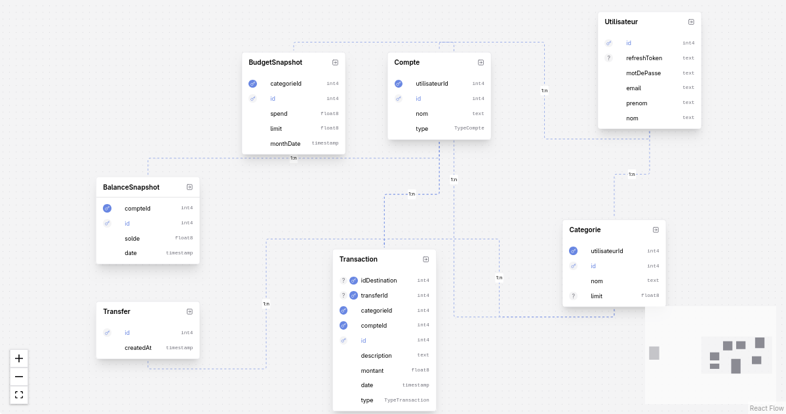

<div align="center">
  <h1>💰 Dirhamy</h1>
  <p><strong>A personal finance and budget management application with AI-driven insights.</strong></p>
</div>

---

## 🚀 Overview

Dirhamy is a full-stack personal finance application designed to handle complex financial transactions, budget tracking, and real-time data aggregation. The project was built with a focus on performance, data consistency, and security, utilizing a microservices-inspired architecture to ensure scalability.

## ✨ Key Features & Technical Highlights

- **Data Integrity & Consistency:** Implements double-entry accounting principles within PostgreSQL, utilizing Prisma ORM `$transaction` blocks to ensure ACID compliance during complex operations like cross-account transfers and balance snapshots.
- **Performance Optimization:** Features a distributed Redis caching layer with intelligent cache invalidation, reducing database load for frequently accessed endpoints.
- **Advanced Pagination:** Utilizes cursor-based pagination for transaction histories to maintain constant-time query performance (`O(1)`) even as the dataset grows significantly.
- **AI-Powered Insights:** Integrates large language models (via Google Generative AI and GROQ SDK) to generate weekly financial summaries and provide an interactive AI assistant for users.
- **Security & Resilience:** Incorporates layered rate limiting (`rate-limiter-flexible`) to prevent brute-force attacks and DDoS, along with strict JWT-based authentication. The application has been audited using OWASP ZAP to ensure robust security postures against common vulnerabilities.
- **Containerization:** Fully dockerized ecosystem (`docker-compose`) containing the Node.js API, NGINX frontend, PostgreSQL database, and Redis cache for consistent deployments.

## 📊 Performance & Security Audits

We actively monitor and optimize the application's performance. Load testing was conducted against the transaction retrieval endpoints to validate our caching strategies. 

**Load Test Results (`/transactions/user`)**
*Parameters: 10 concurrent workers, 200 total requests*

| Metric | Direct Database Query | Redis Cache Enabled | Improvement |
| :--- | :--- | :--- | :--- |
| **Average Latency** | 97.05 ms | 35.73 ms | **~63% Faster** |
| **Throughput** | 92.34 req/sec | 233.37 req/sec | **~152% Capacity Increase** |

The introduction of the caching layer significantly reduces latency and protects the primary database during traffic spikes. Full details can be found in the [`docs/cachingTest.md`](./docs/cachingTest.md).

Additionally, security audits are periodically run using **OWASP ZAP**. Detailed vulnerability reports are available in the `docs/` directory.

## 🏗️ Architecture

<div align="center">
  
  <p><i>Relational data model: Transactions, Categories, Budgets, Users, and Transfers.</i></p>
</div>

### System Flow
1. **NGINX (Reverse Proxy):** Serves the frontend and securely routes API traffic.
2. **Node.js API:** Handles business logic, utilizing a clean layered architecture (Routers → Controllers → Services).
3. **Redis:** Intercepts GET requests and serves cached data. Invalidated upon write operations.
4. **PostgreSQL:** Primary data store, updated via Prisma ORM.
5. **Background Workers:** Node-cron jobs handle asynchronous tasks like monthly budget snapshots without blocking the main event loop.

## 🛠️ Technology Stack

**Backend**
- Node.js, Express.js, TypeScript
- PostgreSQL (with `pgvector`), Prisma ORM
- Redis (`ioredis`)
- JWT, `bcryptjs`, Zod, `rate-limiter-flexible`
- AI integrations: `@google/generative-ai`, `groq-sdk`
- Testing: Vitest, Supertest

**Frontend**
- HTML5, CSS3, Vanilla JavaScript (ES6 Modules)
- NGINX Web Server

**Infrastructure**
- Docker & Docker Compose

## 🚦 Getting Started (Local Environment)

You can run the entire Dirhamy ecosystem locally using Docker.

1. **Clone the repository:**
   ```bash
   git clone https://github.com/MYH-Projet/dirhamy.git
   cd dirhamy
   ```

2. **Environment Variables:**
   Navigate into `backend/` and configure the `.env` file using `.env.example` as a template.

3. **Start the containers:**
   ```bash
   docker-compose up --build
   ```
   > This command initializes PostgreSQL, applies database migrations, seeds initial data, starts Redis, launches the backend API, and serves the frontend.

4. **Access:**
   - **Frontend:** `http://localhost:8080`
   - **API:** `http://localhost:3000`
